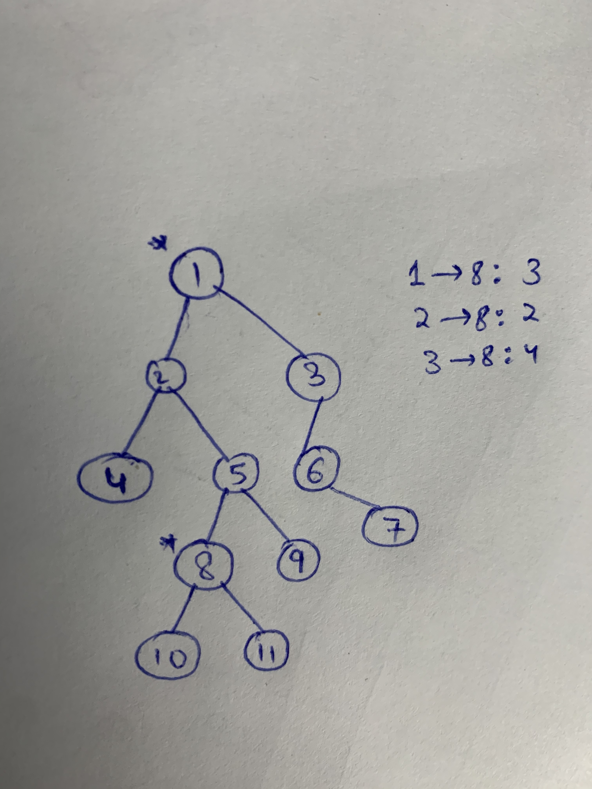

# Solution
_If the distance from a node to target node is k, the distance from its child to the target node is k + 1 unless the child node is closer to the target node which means the target node is in it's subtree._

To understand this, consider the graph below:


Here, the distance between 1 and 8 (target node) is 3 (= k). Now, the distance between 3 and 8 = 4 = k+1 as 3 is 1's child. 2 is also 1's child but distance between 2 and 8 is not equal to k+1 but instead less than that. This is because 2 is closer to the target node, i.e., target node is in its subtree (8 is in 2's subtree).

Getting back to the actual question, our first step is to store all the nodes from the root to the target node in a map along with their distance from the root node. For the image above, our map after storing the distances would look like:
```
1 -> 3
2 -> 2
5 -> 1
8 -> 0
```

Now, we simply use dfs to traverse the whole tree while keeping a "level" variable. Every time when we meet a node which is already stored in the map, we use the stored value in map instead of the value from its parent node, i.e., instead of doing level=level+1 we do level=value stored in map.

Let us try to understand this for the above graph. Say target node = 5 and k = 3. We store the in hashmap the following:
```
1 -> 2
2 -> 1
5 -> 0
```
Now, while performing dfs, we start with 1. 1 is present in hashmap so we set level = 2. Now, we go to 3. 3's level is 1's level + 1 = k so we add it to the answer and return from here as all the nodes in the subtree of 3 will have a higher level. Now, if we go to 2 from 1, 2 is also present in hashmap so we set level=1. Now, if we go to 4, level=3 so we push 4 to our answer. And so on...

```
class Solution {
public:
    unordered_map<TreeNode*, int> m;
    vector<int> res;
    vector<int> distanceK(TreeNode* root, TreeNode* target, int K) {
        helper (root, target);
        dfs(root, 0, K);
        
        return res;
    }
    
    int helper (TreeNode* root, TreeNode* target) {
        if (target == root) {
            m[target] = 0;
            return 0;
        }
        if (!root)
            return -1;
        
        int left = helper(root->left, target);
        if (left != -1) {
            m[root] = 1+left;
            return 1+left;
        }
        
        int right = helper(root->right, target);
        if (right != -1) {
            m[root] = 1+right;
            return 1+right;
        }
        return -1;
    }
    
    void dfs (TreeNode *root, int lvl, int& k) {
        if (!root)
            return;
        if (m.find(root) != m.end())
            lvl = m[root];
        if (lvl==k)
            res.push_back(root->val);
        dfs(root->left, lvl+1, k);
        dfs(root->right, lvl+1, k);
    }
};
```
Time complexity: O(n) where n is the number of nodes in the graph