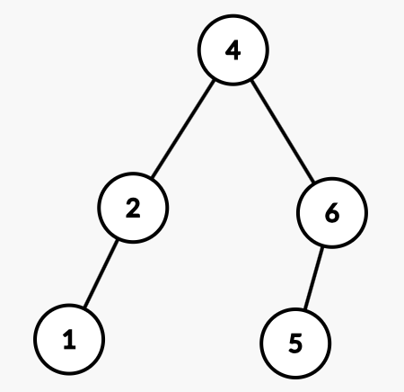

Recommended solving: [LC 297. Serialize and Deserialize Binary Tree](https://leetcode.com/problems/serialize-and-deserialize-binary-tree/) (although it has the tag "hard", the question is actually easier than this one).

# Solution
Since a BST is also a Binary Tree, we can serialize it like a binary tree by storing something like "#" when we encounter a null value (see question above). The special case here is that we don't need to store null values for BST.
Consider this serialize function which is just like preorder traversal:
```
// Encodes a tree to a single string.
string serialize(TreeNode* root) {
    if (root == NULL)
        return "";
    string s = to_string(root->val);
    if (root->left)
        s += ','+serialize(root->left);
    if (root->right)
        s += ','+serialize(root->right);
    
    return s;
}
```
Consider this tree:


The serialization for this tree is "4,2,1,6,5".

Now, if we were to deserialize the tree keeping in mind that we serialized it in preorder fashion (root, left, right), how do we identify when it is the end of a subtree? We haven't stored null values so we need a way to move from left subtree to right subtree. This will help understand that:
```
Let us try to deserialize the string.

4 = root
Now, we will first look for the left subtree of 4. Notice that all the nodes should be < 4 as it is a BST.

2 < 4 ? yes. So 2 = 2->left
Look for left subtree of 2. Again, all nodes in left subtree of 2 should be < 2 as it is a BST.

1 < 2 ? yes. So 1 = 2->left
Look for left subtree of 1.

6 < 1 ? no. So 1->left is NULL.
Now, look for right subtree of 1. Notice that all nodes here should be > 1 but also < 2.

6 > 1 ? yes, 6 < 2 ? no. So 1->right is NULL.
Now, we backtrack and look for right subtree of 2. Notice that all nodes here should be > 2 but also < 4.

6 > 2 ? yes, 6 < 4 ? no. So 2->right is NULL.
Now, we look for right subtree of 4. All nodes here should be > 4.

6 > 4 ? yes. So 6 = 4->right.
Now, look for left subtree of 6. All nodes here should be <6 and >4.

5 > 4 ? yes, 5 < 6 ? yes. So 5 = 6->left.
Now, we have reached the end of string. We'll stop here.
```

Notice how we used BST's property to deserialize the string. Due to this special property, we didn't require any specification of NULL nodes in the serialized string.

Both approaches for deserializing below have same time complexity.

## Deserializing using queue
```
// Decodes your encoded data to tree.
TreeNode* deserialize(string data) {
    if (data == "")
        return NULL;
    stringstream s(data);
    queue<int> q;
    string temp;
    while (getline(s, temp, ',')) {
        q.push(stoi(temp));
    }
    return helper(q, INT_MIN, INT_MAX);
}

TreeNode* helper (queue<int>& q, int lower, int upper) {
    if (q.empty())
        return NULL;
    int num = q.front();
    if (num>=upper || num<=lower)
        return NULL;
    q.pop();
    TreeNode *node = new TreeNode(num);
    node->left = helper(q, lower, num);
    node->right = helper(q, num, upper);
    
    return node;
}
```

## Deserializing without queue
```
// Decodes your encoded data to tree.
TreeNode* deserialize(string data) {
    if (data == "")
        return NULL;
    int idx = 0;
    return helper(data, idx, INT_MIN, INT_MAX);
}

TreeNode* helper (string& data, int& idx, int lower, int upper) {
    if (idx>=data.length())
        return NULL;
    int separatorIdx = data.find(',', idx);
    int num = stoi(data.substr(idx, separatorIdx-idx));
    if (num>=upper || num<=lower)
        return NULL;
    idx = separatorIdx+1;
    TreeNode *node = new TreeNode(num);
    node->left = helper(data, idx, lower, num);
    node->right = helper(data, idx, num, upper);
    
    return node;
}
```