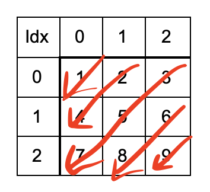

# Solution
## Approach 1
Instead of thinking about alternative direction traversal, we can simply traverse diagonals in one direction and reverse the result alternatively.


We can traverse as shown in the image above and reverse the result of 1st, 3rd and 5th traversal.  
To traverse like that, we start from i=0, j=0. Then, as we go down the arrow above, we go to the next row but previous column so do i++, j--. Now, if i or j goes out of bounds, it means that diagonal is complete.
Note the start index of the diagonals:
```
Diagonal 1: 0,0
Diagonal 2: 0,1
Diagonal 3: 0,2
Diagonal 4: 1,2
Diagonal 5: 2,2

Observe that for start of the diagonal, i=0 and j=previous j+1 until j reaches no. of columns-1. Then, i=previous i+1 and j=2 until i reaches no. of rows-1.
```
Code:
```
vector<int> findDiagonalOrder(vector<vector<int>>& matrix) {
    int i=0, j=0, r=matrix.size(), di = 0, dj = 1; // use di and dj for incrementing i and j which are starting point of a new diagonal

    // sanity check
    if (r==0)
        return {};

    int c = matrix[0].size();
    bool up = true; // used for reversing
    vector<int> res;

    while (res.size() < r*c) {
        int count=0;
        // start from {i,j} and traverse until row/col goes out of bound
        for (int x=i, y=j; x<r && y>=0; x++, y--, count++) {
            res.push_back(matrix[x][y]);
        }

        // if j reaches no. of columns-1, stop incrementing j and start incrementing i
        if (j==c-1) {
            di = 1;
            dj = 0;
        }
        i += di;
        j += dj;

        // reverse if needed
        if (up) {
            reverse(res.end()-count, res.end());
        }

        // alternating reversal
        up = !up;
    }

        return res;
    }
```
Time complexity: O(mn)
Space complexity: O(1)

## Approach 2: Observing edge cases (by )
Solution given by [shawngao](https://leetcode.com/problems/diagonal-traverse/discuss/97712/Concise-Java-Solution).

The following edge cases can be observed while traversing diagonally:
- If out of bottom border (row >= m) then row = m - 1; col += 2; change walk direction.
- if out of right border (col >= n) then col = n - 1; row += 2; change walk direction.
- if out of top border (row < 0) then row = 0; change walk direction.
- if out of left border (col < 0) then col = 0; change walk direction.
- Otherwise, just go along with the current direction.

Code in Java:
```
public int[] findDiagonalOrder(int[][] matrix) {
    if (matrix == null || matrix.length == 0) return new int[0];
    int m = matrix.length, n = matrix[0].length;
    
    int[] result = new int[m * n];
    int row = 0, col = 0, d = 0;
    int[][] dirs = { {-1, 1}, {1, -1} };
    
    for (int i = 0; i < m * n; i++) {
        result[i] = matrix[row][col];
        row += dirs[d][0];
        col += dirs[d][1];
        
        if (row >= m) { row = m - 1; col += 2; d = 1 - d;}
        if (col >= n) { col = n - 1; row += 2; d = 1 - d;}
        if (row < 0)  { row = 0; d = 1 - d;}
        if (col < 0)  { col = 0; d = 1 - d;}
    }
    
    return result;
}
```
Time complexity: O(mn)
Space complexity: O(1)