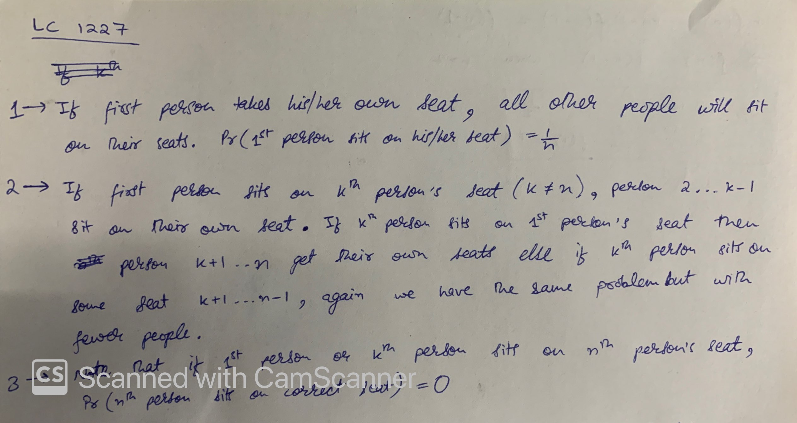
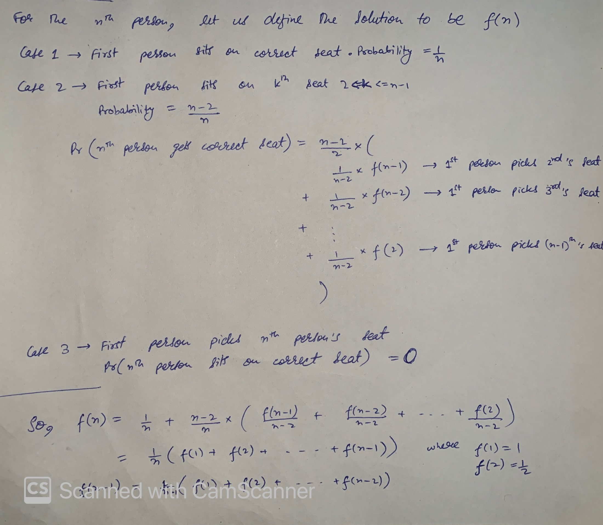
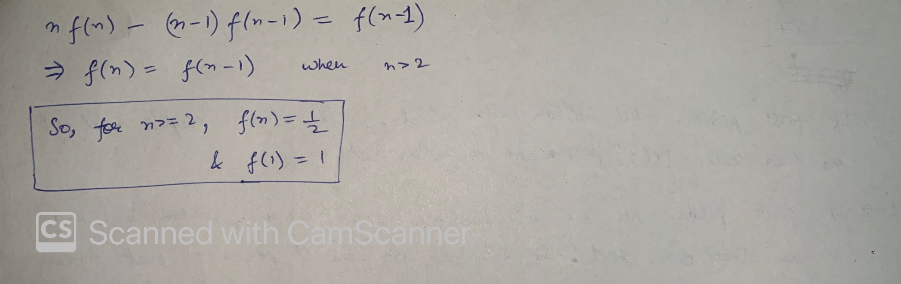

Although the question can be solved using Dynamic Programming, we still require some math to come to that solution. The math is explained below and a recurrence formula is derived. We can employ DP using that recurrence formula or further as we see, we can solve the problem in O(1) time. The solution below is inspired by the [post by @winterock](https://leetcode.com/problems/airplane-seat-assignment-probability/discuss/411905/It's-not-obvious-to-me-at-all.-Foolproof-explanation-here!!!-And-proof-for-why-it's-12).





By the proof above, for n>=2, the answer is 0.5
```
double nthPersonGetsNthSeat(int n) {
		if (n==1)
				return 1;
		else return 0.5;
}
```

Alternatively, DP solution:
```
double nthPersonGetsNthSeat(int n) {
		double dp[n+1];
		dp[0] = dp[1] = 1;
		for (int i=2; i<=n; i++) {
				dp[i] = (double)1/i*(dp[i-1]);
				if (i==n)
						break;
				// dp[i] = dp[1]+dp[2]+dp[3]...+dp[i] for all i<n
				dp[i] += dp[i-1];
		}

		return dp[n];
}
```