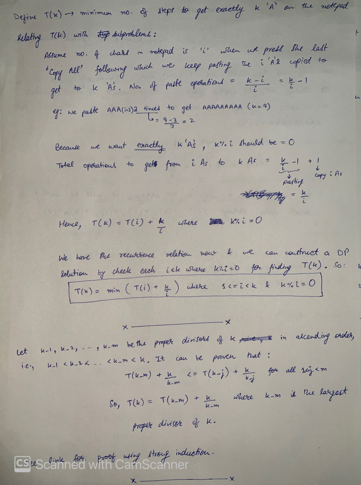
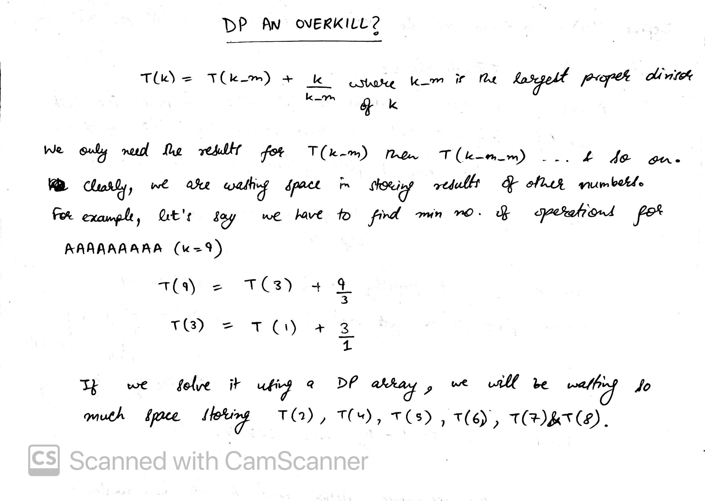

## Using DP
Most of the solutions of this problem which exist on LeetCode Discuss do not prove the recurrence property they are using (as you'll understand below). Below is an elaborate discussion inspired by the [this post](https://leetcode.com/problems/2-keys-keyboard/discuss/105932/Java-solutions-from-naive-DP-to-optimized-DP-to-non-DP). The discussion does not contain a mathematically intensive proof which is required to solve the problem more optimally. Please look at the [post mentioned earlier](https://leetcode.com/problems/2-keys-keyboard/discuss/105932/Java-solutions-from-naive-DP-to-optimized-DP-to-non-DP) for a proof using mathematical induction.



With the recurrence formula derived above, we can easily implement a DP solution:
```
// Language: Java
public static int minSteps(int n) {
    int[] dp = new int[n + 1];

    for (int k = 2; k <= n; k++) {
        dp[k] = Integer.MAX_VALUE;

        for (int i = 1; i < k; i++) {
            if (k % i != 0) continue;
            dp[k] = Math.min(dp[k], dp[i] + k / i);
        }
    }

    return dp[n];
}
```

Further, assuming `T(k) = T(k_m) + k/k_m` as mentioned above, we can further optimize the solution:
```
// Language: Java
public int minSteps(int n) {
    int[] dp = new int[n + 1];

    for (int k = 2, i = 0; k <= n; k++) {
        for (i = k >> 1; i >= 1 && k % i != 0; i--);

				dp[k] = dp[i] + k / i;
    }

    return dp[n];
}
```

## Without using DP
If you observe the above solution, we only need the greatest divisor for n and then the greatest divisor for that number and so on. So we might be wasting a lot of space using a whole dp[] array.



Let's see a non-DP solution:
```
int minSteps(int n) {
		int res = 0, k_m;
		for (int k=n; k>1; k=k_m) {
				for (k_m=k/2; k%k_m!=0; k_m--);
				res += k/k_m;
		}

		return res;
}
```